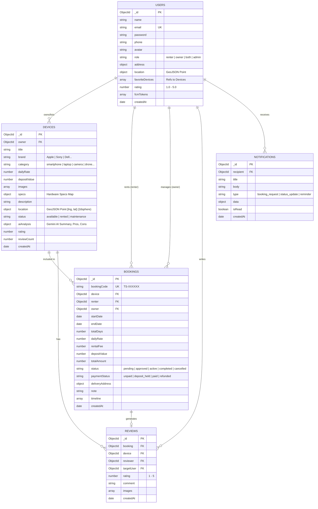

# THIẾT KẾ CƠ SỞ DỮ LIỆU CHUẨN - DỰ ÁN TECHSHARE
## CHUẨN HOÁ 100% CƠ SỞ DỮ LIỆU MONGODB (NOSQL ARCHITECTURE)

---

### 1. TỔNG QUAN KIẾN TRÚC DỮ LIỆU (MONGODB UNIFIED DATABASE)

Toàn bộ dự án **TechShare** được chuẩn hoá sử dụng **MongoDB (MongoDB Atlas)** làm nền tảng CSDL duy nhất xuyên suốt hệ thống:
- **Cloud Database**: MongoDB Atlas Cluster (Replica Set đa vùng, tự động sao lưu, mở rộng linh hoạt).
- **Driver / ODM**: Mongoose ODM trên Node.js Server đảm bảo schema validation chặt chẽ và middleware hooks.
- **Tối ưu hoá Địa lý (Geospatial Index)**: Sử dụng chỉ mục không gian `2dsphere` và chuẩn GeoJSON của MongoDB để phục vụ truy vấn tìm kiếm thiết bị quanh toạ độ người dùng theo thời gian thực (`react-native-maps`).
- **Quy ước Khoá chính & Định danh (`_id: ObjectId`)**:
  - Mọi collection đều sử dụng trường khoá chính `_id` với kiểu `ObjectId` mặc định có sẵn của MongoDB & Mongoose.
  - **Không** khai báo trường `id` thủ công trong schema nhằm đảm bảo tính toàn vẹn dữ liệu, tối ưu B-Tree index và hiệu năng sharding của MongoDB.
  - Mọi quan hệ tham chiếu (Foreign Keys) giữa các bảng (`owner`, `device`, `renter`, `reviewer`,...) đều dùng chuẩn `mongoose.Schema.Types.ObjectId` kèm thuộc tính `ref`.
  - Cấu hình schema `{ toJSON: { virtuals: true }, toObject: { virtuals: true } }` kích hoạt getter virtual `id` (chuỗi hex 24 ký tự) có sẵn của Mongoose, giúp Mobile Client (React Native Expo) và AsyncStorage truy xuất linh hoạt cả `_id` và `id`.
- **Chiến lược Ngoại tuyến (Offline Caching trên Mobile)**: Dữ liệu JSON từ MongoDB được đồng bộ và lưu đệm cục bộ qua `AsyncStorage` (NoSQL Key-Value store đồng nhất cấu trúc với MongoDB documents), giúp ứng dụng hoạt động mượt mà khi mất mạng và tự động đồng bộ khi có kết nối trở lại.



---

### 2. ĐẶC TẢ CHI TIẾT CÁC COLLECTIONS TRONG MONGODB

#### 2.1. Collection: `users`
Lưu trữ thông tin người dùng, tài khoản phân quyền, danh sách thiết bị yêu thích và vị trí toạ độ.

```javascript
import mongoose from 'mongoose';

const userSchema = new mongoose.Schema(
  {
    name: {
      type: String,
      required: [true, 'Họ và tên là bắt buộc'],
      trim: true,
      minlength: 2,
      maxlength: 60,
    },
    email: {
      type: String,
      required: [true, 'Email là bắt buộc'],
      unique: true,
      lowercase: true,
      trim: true,
      match: [/^\w+([.-]?\w+)*@\w+([.-]?\w+)*(\.\w{2,3})+$/, 'Email không hợp lệ'],
    },
    password: {
      type: String,
      required: [true, 'Mật khẩu là bắt buộc'],
      minlength: 6,
      select: false, // Không trả về mật khẩu khi query trừ khi chỉ định rõ
    },
    phone: {
      type: String,
      trim: true,
      default: '',
    },
    avatar: {
      type: String,
      default: 'https://images.unsplash.com/photo-1535713875002-d1d0cf377fde?w=400',
    },
    role: {
      type: String,
      enum: ['renter', 'owner', 'both', 'admin'],
      default: 'both',
    },
    address: {
      street: { type: String, default: '' },
      ward: { type: String, default: '' },
      district: { type: String, default: '' },
      city: { type: String, default: 'Hà Nội' },
      fullAddress: { type: String, default: 'Hà Nội, Việt Nam' },
    },
    location: {
      type: {
        type: String,
        enum: ['Point'],
        default: 'Point',
      },
      coordinates: {
        type: [Number], // [kinh độ (lng), vĩ độ (lat)]
        default: [105.7826, 21.0285],
      },
    },
    favoriteDevices: [
      {
        type: mongoose.Schema.Types.ObjectId,
        ref: 'Device',
      },
    ],
    fcmTokens: [{ type: String }],
    rating: {
      type: Number,
      default: 5.0,
      min: 1.0,
      max: 5.0,
    },
    totalReviews: {
      type: Number,
      default: 0,
    },
    isVerified: {
      type: Boolean,
      default: false,
    },
  },
  {
    timestamps: true,
    toJSON: {
      virtuals: true,
      transform: (doc, ret) => {
        delete ret.password;
        delete ret.__v;
        return ret;
      },
    },
    toObject: { virtuals: true },
  }
);

// Indexes
userSchema.index({ email: 1 }, { unique: true });
userSchema.index({ location: '2dsphere' });
```

---

#### 2.2. Collection: `devices`
Lưu trữ thông tin chi tiết thiết bị cho thuê, toạ độ địa lý phục vụ `react-native-maps`, và kết quả phân tích review từ Gemini AI.

```javascript
const deviceSchema = new mongoose.Schema(
  {
    owner: {
      type: mongoose.Schema.Types.ObjectId,
      ref: 'User',
      required: true,
      index: true,
    },
    title: {
      type: String,
      required: [true, 'Tên thiết bị là bắt buộc'],
      trim: true,
      index: 'text', // Hỗ trợ full-text search
    },
    brand: {
      type: String,
      required: [true, 'Thương hiệu là bắt buộc'],
      trim: true,
      index: true,
    },
    category: {
      type: String,
      required: [true, 'Danh mục thiết bị là bắt buộc'],
      enum: ['smartphone', 'laptop', 'camera', 'drone', 'audio', 'accessory'],
      index: true,
    },
    dailyRate: {
      type: Number,
      required: [true, 'Giá thuê mỗi ngày là bắt buộc'],
      min: [10000, 'Giá thuê tối thiểu là 10.000 VNĐ/ngày'],
      index: true,
    },
    depositValue: {
      type: Number,
      required: [true, 'Tiền đặt cọc là bắt buộc'],
      min: 0,
    },
    images: {
      type: [String],
      required: [true, 'Phải có ít nhất 1 ảnh thiết bị'],
      validate: [val => val.length > 0, 'Phải tải lên ít nhất 1 ảnh'],
    },
    specs: {
      type: Map,
      of: String,
      default: {}, // Ví dụ: { "Chip": "Apple M3 Max", "RAM": "36GB", "Camera": "48MP" }
    },
    description: {
      type: String,
      required: [true, 'Mô tả thiết bị là bắt buộc'],
      index: 'text',
    },
    location: {
      type: {
        type: String,
        enum: ['Point'],
        default: 'Point',
      },
      coordinates: {
        type: [Number], // [lng, lat]
        required: true,
      },
      address: {
        type: String,
        required: true,
      },
    },
    status: {
      type: String,
      enum: ['available', 'rented', 'maintenance', 'hidden'],
      default: 'available',
      index: true,
    },
    rating: {
      type: Number,
      default: 5.0,
      min: 1.0,
      max: 5.0,
    },
    reviewCount: {
      type: Number,
      default: 0,
    },
    aiAnalysis: {
      summary: { type: String, default: '' },
      pros: [{ type: String }],
      cons: [{ type: String }],
      rentalRecommendation: { type: String, default: '' },
      analyzedAt: { type: Date },
    },
    viewsCount: {
      type: Number,
      default: 0,
    },
  },
  {
    timestamps: true,
    toJSON: {
      virtuals: true,
      transform: (doc, ret) => {
        delete ret.__v;
        return ret;
      },
    },
    toObject: { virtuals: true },
  }
);

// GeoJSON 2dsphere index: Phục vụ tìm kiếm bán kính quanh người dùng ($nearSphere)
deviceSchema.index({ location: '2dsphere' });
// Compound index: Tối ưu hoá bộ lọc danh mục và giá thuê
deviceSchema.index({ category: 1, dailyRate: 1, status: 1 });
```

---

#### 2.3. Collection: `bookings`
Quản lý vòng đời đơn thuê từ lúc gửi yêu cầu đến khi bàn giao, hoàn tất hoặc huỷ đơn.

```javascript
const bookingSchema = new mongoose.Schema(
  {
    bookingCode: {
      type: String,
      unique: true,
      required: true,
      index: true,
    },
    device: {
      type: mongoose.Schema.Types.ObjectId,
      ref: 'Device',
      required: true,
      index: true,
    },
    renter: {
      type: mongoose.Schema.Types.ObjectId,
      ref: 'User',
      required: true,
      index: true,
    },
    owner: {
      type: mongoose.Schema.Types.ObjectId,
      ref: 'User',
      required: true,
      index: true,
    },
    startDate: {
      type: Date,
      required: true,
    },
    endDate: {
      type: Date,
      required: true,
    },
    totalDays: {
      type: Number,
      required: true,
      min: 1,
    },
    dailyRate: {
      type: Number,
      required: true,
    },
    rentalFee: {
      type: Number,
      required: true,
    },
    depositValue: {
      type: Number,
      required: true,
      default: 0,
    },
    totalAmount: {
      type: Number,
      required: true,
    },
    status: {
      type: String,
      enum: ['pending', 'approved', 'handover_in_progress', 'active', 'returned', 'completed', 'cancelled', 'rejected'],
      default: 'pending',
      index: true,
    },
    paymentStatus: {
      type: String,
      enum: ['unpaid', 'deposit_held', 'paid', 'refunded'],
      default: 'unpaid',
    },
    deliveryAddress: {
      recipientName: { type: String, required: true },
      phone: { type: String, required: true },
      address: { type: String, required: true },
    },
    note: {
      type: String,
      default: '',
    },
    handoverPhotos: {
      beforeRental: [{ type: String }],
      afterRental: [{ type: String }],
    },
    timeline: [
      {
        status: { type: String, required: true },
        updatedAt: { type: Date, default: Date.now },
        note: { type: String, default: '' },
      },
    ],
  },
  {
    timestamps: true,
    toJSON: {
      virtuals: true,
      transform: (doc, ret) => {
        delete ret.__v;
        return ret;
      },
    },
    toObject: { virtuals: true },
  }
);

// Compound indexes
bookingSchema.index({ renter: 1, status: 1, createdAt: -1 });
bookingSchema.index({ owner: 1, status: 1, createdAt: -1 });
bookingSchema.index({ device: 1, startDate: 1, endDate: 1 });
```

---

#### 2.4. Collection: `reviews`
Lưu trữ đánh giá thực tế giữa người thuê và chủ máy sau khi hoàn tất giao dịch.

```javascript
const reviewSchema = new mongoose.Schema(
  {
    booking: {
      type: mongoose.Schema.Types.ObjectId,
      ref: 'Booking',
      required: true,
      unique: true, // Mỗi đơn thuê chỉ đánh giá 1 lần
    },
    device: {
      type: mongoose.Schema.Types.ObjectId,
      ref: 'Device',
      required: true,
      index: true,
    },
    reviewer: {
      type: mongoose.Schema.Types.ObjectId,
      ref: 'User',
      required: true,
    },
    targetUser: {
      type: mongoose.Schema.Types.ObjectId,
      ref: 'User',
      required: true,
      index: true,
    },
    rating: {
      type: Number,
      required: true,
      min: 1,
      max: 5,
    },
    comment: {
      type: String,
      required: [true, 'Nội dung nhận xét là bắt buộc'],
      maxlength: 1000,
    },
    images: [{ type: String }],
  },
  {
    timestamps: true,
    toJSON: {
      virtuals: true,
      transform: (doc, ret) => {
        delete ret.__v;
        return ret;
      },
    },
    toObject: { virtuals: true },
  }
);
```

---

#### 2.5. Collection: `notifications`
Lưu trữ thông báo hệ thống và push notifications đến từng người dùng.

```javascript
const notificationSchema = new mongoose.Schema(
  {
    recipient: {
      type: mongoose.Schema.Types.ObjectId,
      ref: 'User',
      required: true,
      index: true,
    },
    title: {
      type: String,
      required: true,
    },
    body: {
      type: String,
      required: true,
    },
    type: {
      type: String,
      enum: ['booking_request', 'booking_approved', 'booking_cancelled', 'reminder', 'system'],
      default: 'system',
    },
    data: {
      bookingId: { type: mongoose.Schema.Types.ObjectId, ref: 'Booking' },
      deviceId: { type: mongoose.Schema.Types.ObjectId, ref: 'Device' },
    },
    isRead: {
      type: Boolean,
      default: false,
      index: true,
    },
  },
  {
    timestamps: true,
    toJSON: {
      virtuals: true,
      transform: (doc, ret) => {
        delete ret.__v;
        return ret;
      },
    },
    toObject: { virtuals: true },
  }
);

notificationSchema.index({ recipient: 1, isRead: 1, createdAt: -1 });
```

---

### 3. CHIẾN LƯỢC TRUY VẤN MONGODB NÂNG CAO

#### 3.1. Tìm kiếm thiết bị quanh toạ độ bán kính (Geospatial `$nearSphere`)
Phục vụ màn hình **Bản đồ (`react-native-maps`)**:
```javascript
const getNearbyDevices = async (latitude, longitude, maxDistanceMeters = 15000) => {
  return await Device.find({
    status: 'available',
    location: {
      $nearSphere: {
        $geometry: {
          type: 'Point',
          coordinates: [longitude, latitude], // Chuẩn GeoJSON: [Kinh độ, Vĩ độ]
        },
        $maxDistance: maxDistanceMeters,
      },
    },
  }).populate('owner', 'name avatar phone rating');
};
```

#### 3.2. Caching Ngoại tuyến đồng nhất (MongoDB Sync & AsyncStorage)
- Trên ứng dụng **Client**: Khi người dùng duyệt danh sách thiết bị hoặc bấm nút yêu thích, dữ liệu JSON chuẩn của MongoDB Document được lưu đệm vào `AsyncStorage` dưới dạng key-value.
- Khi thiết bị không có kết nối Internet, ứng dụng tự động tải dữ liệu từ cache `AsyncStorage`.
- Mô hình này đồng bộ hoàn toàn kiểu dữ liệu JSON giữa MongoDB và Mobile, loại bỏ sự phức tạp và lỗi xung đột khi phải chuyển đổi giữa SQL và NoSQL.
