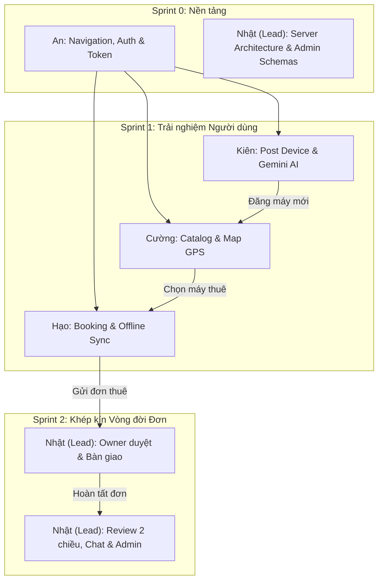

# 👥 BẢNG PHÂN CHIA TÍNH NĂNG NHÓM 5 THÀNH VIÊN
## DỰ ÁN TECHSHARE - NỀN TẢNG THUÊ THIẾT BỊ CÔNG NGHỆ & TRỢ LÝ GEMINI AI
> **Môn học**: MMA301 - Cross-Platform Mobile Applications Development  
> **Quy mô**: 5 Thành viên (**An, Cường, Hạo, Kiên, Nhật (Lead)**)  
> **Công nghệ**: React Native (Expo SDK 57), Node.js (Express), MongoDB Atlas, Google Gemini AI  
> **Tài liệu tham chiếu**: [FEATURES.md](file:///e:/Repo/tech-share/docs/FEATURES.md), [API_SPECIFICATION.md](file:///e:/Repo/tech-share/docs/API_SPECIFICATION.md), [DATABASE_DESIGN.md](file:///e:/Repo/tech-share/docs/DATABASE_DESIGN.md)

---

## 📌 QUY ƯỚC ĐỘ ƯU TIÊN (PRIORITY LEVELS)

- 🔴 **P0 (Critical / Core MVP)**: Bắt buộc hoàn thành đầu tiên. Là các tính năng sống còn để hệ thống chạy thông luồng từ Client ➔ Server ➔ Database.
- 🟡 **P1 (High / Key Feature)**: Tính năng nghiệp vụ quan trọng, hoàn thiện chu trình trải nghiệm thực tế và giải quyết bài toán chống gian lận.
- 🟢 **P2 (Medium / Value-Added & Wow Factor)**: Tính năng mở rộng thông minh (AI, Biometrics, Gamification, Offline-First nâng cao), tạo sự khác biệt và giúp nhóm đạt điểm xuất sắc (9.0 - 10.0).

---

## 📊 TỔNG QUAN PHÂN BỔ NHIỆM VỤ

| STT | Thành viên | Vai trò kỹ thuật | Luồng tính năng phụ trách (Cohesive Flow) | Số tính năng | Tỷ trọng |
| :---: | :--- | :--- | :--- | :---: | :---: |
| **1** | **An** | **Mobile Architect & Security Engineer** | **Khung điều hướng, Định danh, Xác thực, Hồ sơ & eKYC Tín nhiệm** | 8 tính năng | 20% |
| **2** | **Cường** | **Frontend Engineer (Discovery & Maps)** | **Khám phá Thiết bị, Tìm kiếm đa tiêu chí & Bản đồ không gian GPS** | 8 tính năng | 20% |
| **3** | **Hạo** | **Frontend Engineer (Booking & Offline)** | **Quy trình Đặt thuê, Vòng đời Đơn hàng & Trải nghiệm Ngoại tuyến** | 8 tính năng | 20% |
| **4** | **Kiên** | **Fullstack & AI Engineer** | **Đăng tin Cho thuê, Quản lý Kho máy & Trợ lý Gemini AI Hub** | 8 tính năng | 20% |
| **5** | **Nhật (Lead)** | **Team Leader & Operations/Backend Lead** | **Vận hành Đơn, Đánh giá 2 chiều, Chat thời gian thực & Admin Hub** | 8 tính năng | 20% |

---

## 1. THÀNH VIÊN 1: AN
### 🏛️ Luồng phụ trách: KHUNG ĐIỀU HƯỚNG, ĐỊNH DANH, XÁC THỰC, HỒ SƠ & E-KYC TÍN NHIỆM
> **Mục tiêu luồng**: Xây dựng toàn bộ hạ tầng điều hướng 3 tầng vững chắc, quản lý phiên làm việc bền vững, bảo vệ dữ liệu người dùng và thiết lập cơ chế tín nhiệm định danh cho toàn bộ ứng dụng.

| Mã | Tên tính năng | Mô tả chi tiết | Màn hình / Component | Backend API & DB | Độ ưu tiên |
| :---: | :--- | :--- | :--- | :--- | :---: |
| **A-01** | **Bộ khung Điều hướng 3 tầng** | Cấu hình React Navigation 7: Native Stack lồng Drawer lồng Bottom Tab; chuyển đổi tab động theo role kép `both`. | `RootNavigator.tsx`, `AppDrawer.tsx`, `BottomTabNavigator.tsx` | - | 🔴 **P0** |
| **A-02** | **Đăng ký tài khoản (Register)** | Đăng ký thành viên: Tên, Email, Mật khẩu, SĐT; kiểm tra hợp lệ Formik + Yup; mã hóa `bcryptjs`, gán role `both`. | `RegisterScreen.tsx` | `POST /api/auth/register`<br>`User` Model | 🔴 **P0** |
| **A-03** | **Đăng nhập & Phiên JWT (Login)** | Xác thực đăng nhập, sinh Bearer JWT, tự động lưu token và đồng bộ phiên đăng nhập vào AsyncStorage. | `LoginScreen.tsx` | `POST /api/auth/login`<br>`authMiddleware.js` | 🔴 **P0** |
| **A-04** | **Hồ sơ Cá nhân (Profile View/Edit)** | Xem và cập nhật thông tin cá nhân, cập nhật địa chỉ mặc định, đổi ảnh đại diện (Avatar). | `ProfileScreen.tsx` | `GET /api/auth/me`<br>`PUT /api/auth/profile` | 🔴 **P0** |
| **A-05** | **Onboarding Slider** | 3 slide giới thiệu ngắn gọn tiện ích nền tảng khi mở app lần đầu; lưu trạng thái đã xem vào AsyncStorage. | `OnboardingScreen.tsx` | Cục bộ AsyncStorage | 🟡 **P1** |
| **A-06** | **Xác thực Sinh trắc học (Biometrics)** | Mở khóa app nhanh và xác nhận thanh toán/cọc bằng Cảm biến vân tay hoặc Nhận diện khuôn mặt (FaceID). | `BiometricAuthModal.tsx` | `expo-local-authentication` | 🟢 **P2** |
| **A-07** | **Xác minh Danh tính Điện tử (eKYC)** | Chụp ảnh 2 mặt CCCD và ảnh chân dung selfie gửi yêu cầu xét duyệt cấp Tích xanh uy tín (`isVerified: true`). | `EkycVerificationScreen.tsx` | `POST /api/auth/ekyc`<br>`User.isVerified` | 🟡 **P1** |
| **A-08** | **Hệ thống Điểm Tín nhiệm (Trust Score)** | Tính toán và hiển thị điểm uy tín người dùng (thưởng điểm trả đúng hạn, trừ điểm vi phạm); ưu đãi giảm cọc khi điểm cao. | `TrustScoreCard.tsx` (trong Profile) | `GET /api/users/:id/trust-score`<br>`User.trustScore` | 🟢 **P2** |

---

## 2. THÀNH VIÊN 2: CƯỜNG
### 🔍 Luồng phụ trách: KHÁM PHÁ THIẾT BỊ, TÌM KIẾM ĐA TIÊU CHÍ & BẢN ĐỒ GPS KHÔNG GIAN
> **Mục tiêu luồng**: Giúp người dùng dễ dàng lướt xem hàng ngàn thiết bị công nghệ, lọc chính xác theo nhu cầu ngân sách và định vị vị trí thiết bị quanh khu vực thực tế của mình trên bản đồ tương tác.

| Mã | Tên tính năng | Mô tả chi tiết | Màn hình / Component | Backend API & DB | Độ ưu tiên |
| :---: | :--- | :--- | :--- | :--- | :---: |
| **C-01** | **Trang chủ & 6 Danh mục Thiết bị** | Giao diện Home gồm thanh tìm kiếm, Banner carousel, thanh trượt 6 danh mục (Smartphone, Laptop, Camera, Drone, Audio, Phụ kiện). | `HomeScreen.tsx`, `CategoryBar.tsx` | `GET /api/devices` (query category)<br>`Device` Model | 🔴 **P0** |
| **C-02** | **Lưới Thiết bị (Device Grid & Card)** | Hiển thị danh sách thiết bị dạng lưới 2 cột: Ảnh đại diện, Tên máy, Giá thuê/ngày, Rating sao, Khoảng cách và Nút thả tim. | `DeviceCard.tsx`, `DeviceGrid.tsx` | `GET /api/devices?page=1&limit=10` | 🔴 **P0** |
| **C-03** | **Chi tiết Thiết bị (Device Detail)** | Xem Carousel album ảnh thực tế, bảng thông số kỹ thuật (specs), giá cọc, mô tả và card thông tin chủ máy. | `DeviceDetailScreen.tsx`, `SpecsTable.tsx` | `GET /api/devices/:id`<br>`populate('owner')` | 🔴 **P0** |
| **C-04** | **Tìm kiếm Tức thì (Live Search)** | Tìm kiếm từ khóa theo tên máy, hãng, thông số; tích hợp cơ chế Debounce 400ms và hiển thị từ khóa xu hướng hot. | `SearchBar.tsx`, `SearchSuggestions.tsx` | `GET /api/devices?keyword=...` (regex) | 🔴 **P0** |
| **C-05** | **Modal Bộ lọc Nâng cao (Multi-Filter)** | Lọc kết hợp đa tiêu chí: Tầm giá thuê/ngày (Slider), Hãng sản xuất (Apple, Sony, DJI...), Bán kính GPS, Sắp xếp giá/sao. | `FilterModal.tsx` | `GET /api/devices?minPrice=&maxPrice=&brand=&sort=` | 🟡 **P1** |
| **C-06** | **Bản đồ Tương tác GPS (Interactive Map)** | Tích hợp `react-native-maps`, xin quyền vị trí qua `expo-location`, hiển thị vị trí người dùng và ghim các máy cho thuê. | `MapScreen.tsx` | `expo-location`<br>`GET /api/devices/nearby` | 🔴 **P0** |
| **C-07** | **Marker & Callout Thông minh** | Chạm Marker ghim trên bản đồ bung thẻ Callout tóm tắt (ảnh, giá, khoảng cách km) kèm nút bấm chuyển sang màn chi tiết. | `DeviceMarker.tsx`, `MapCallout.tsx` | MongoDB `$nearSphere` & index `2dsphere` | 🟡 **P1** |
| **C-08** | **Gom cụm Bản đồ (Marker Clustering)** | Tự động gom cụm các ghim gần nhau thành vòng tròn số lượng khi thu nhỏ bản đồ, chống rối mắt và giật lag. | `ClusteredMapView.tsx` | Thuật toán gom cụm SuperCluster | 🟢 **P2** |

---

## 3. THÀNH VIÊN 3: HẠO
### 📦 Luồng phụ trách: QUY TRÌNH ĐẶT THUÊ, VÒNG ĐỜI ĐƠN HÀNG & TRẢI NGHIỆM NGOẠI TUYẾN
> **Mục tiêu luồng**: Hiện thực hóa trải nghiệm đặt thuê mượt mà, tự động hóa tính toán chi phí minh bạch, ngăn chặn trùng lịch thuê, giao nhận an toàn qua mã QR và hỗ trợ xem dữ liệu liên tục ngay cả khi mất mạng.

| Mã | Tên tính năng | Mô tả chi tiết | Màn hình / Component | Backend API & DB | Độ ưu tiên |
| :---: | :--- | :--- | :--- | :--- | :---: |
| **H-01** | **Màn hình Đặt thuê & Date Picker** | Chọn ngày nhận và ngày trả máy qua DateRangePicker; tự động hiển thị ngày bận chống đặt trùng lịch. | `BookingCreateScreen.tsx`, `CalendarPicker.tsx` | `POST /api/bookings`<br>`Booking` Model | 🔴 **P0** |
| **H-02** | **Bộ tính Chi phí & Áp dụng Voucher** | Tự động tính số ngày, tiền thuê, chiết khấu thuê dài ngày (>=3 ngày giảm 10%, >=7 ngày giảm 20%), tiền cọc và trừ mã voucher. | `PriceBreakdownCard.tsx`, `VoucherInput.tsx` | Logic tính toán `bookingController.js` | 🔴 **P0** |
| **H-03** | **Quản lý Đơn của tôi (My Bookings)** | Màn hình danh sách đơn cá nhân chia 5 tab tiến trình: Chờ duyệt (`pending`), Đã duyệt (`approved`), Đang thuê (`active`), Đã xong, Đã hủy. | `MyBookingsScreen.tsx`, `BookingItemCard.tsx` | `GET /api/bookings/my-bookings` | 🔴 **P0** |
| **H-04** | **Chi tiết Đơn & Timeline Tiến độ** | Xem chi tiết đơn thuê, sơ đồ Timeline tiến độ từng bước, thông tin giao hàng và nút Hủy đơn khi còn `pending`. | `BookingDetailScreen.tsx`, `OrderTimeline.tsx` | `GET /api/bookings/:id`<br>`PATCH /api/bookings/:id/cancel` | 🔴 **P0** |
| **H-05** | **Đồng hồ Đếm ngược & Gia hạn Thuê** | Đếm ngược thời gian thuê còn lại (ngày/giờ/phút); gửi yêu cầu gia hạn thuê thêm ngày trực tiếp tới chủ máy. | `RentalCountdownTimer.tsx`, `ExtensionModal.tsx` | `POST /api/bookings/:id/extend` | 🟡 **P1** |
| **H-06** | **Mã QR Giao nhận & Ảnh lúc nhận** | Xuất trình mã QR đơn hàng để chủ máy quét xác nhận; chụp ảnh 4 góc máy lúc nhận bàn giao (`handoverPhotos.beforeRental`). | `HandoverQrModal.tsx`, `HandoverCamera.tsx` | `PATCH /api/bookings/:id/handover-renter` | 🟡 **P1** |
| **H-07** | **Wishlist & Cơ chế Offline-First** | Nút thả tim lưu máy vào Yêu thích; tự động đồng bộ Wishlist và Lịch sử đơn vào AsyncStorage; tự đọc cache khi mất mạng. | `WishlistScreen.tsx`, `OfflineBanner.tsx` | Tiện ích `AsyncStorage` + NetInfo | 🟡 **P1** |
| **H-08** | **Tạo Đơn nháp Ngoại tuyến (Draft Booking)** | Cho phép chọn máy và điền thông tin đặt thuê nháp khi offline; tự động đẩy đơn lên server ngay khi có kết nối mạng trở lại. | `DraftBookingService.ts` | Queue lưu cục bộ + Background Sync | 🟢 **P2** |

---

## 4. THÀNH VIÊN 4: KIÊN
### 🤖 Luồng phụ trách: ĐĂNG TIN CHO THUÊ, QUẢN LÝ KHO MÁY & TRỢ LÝ GEMINI AI HUB
> **Mục tiêu luồng**: Cung cấp bộ công cụ đăng tin tiện lợi cho chủ máy (chụp ảnh thực tế, tự gắn GPS), quản lý kho thiết bị linh hoạt và tích hợp các tính năng đột phá của Trí tuệ nhân tạo Google Gemini AI.

| Mã | Tên tính năng | Mô tả chi tiết | Màn hình / Component | Backend API & DB | Độ ưu tiên |
| :---: | :--- | :--- | :--- | :--- | :---: |
| **K-01** | **Đăng tin Thiết bị mới (Post Device)** | Form đăng tin cho thuê: Tên máy, danh mục, thương hiệu, giá thuê/ngày, tiền cọc, mô tả và bảng thông số kỹ thuật (specs). | `PostDeviceScreen.tsx`, `SpecsInputForm.tsx` | `POST /api/devices`<br>`Device` Model | 🔴 **P0** |
| **K-02** | **Chụp/Chọn Ảnh & Gắn Tọa độ GPS** | Tải tối đa 8 ảnh từ Camera hoặc Gallery (`expo-image-picker`); tự động lấy tọa độ GPS hiện tại (`expo-location`) gắn vào tin đăng. | `ImageUploadGrid.tsx`, `LocationPickerButton.tsx` | `location.coordinates` GeoJSON `Point` | 🔴 **P0** |
| **K-03** | **Quản lý Thiết bị của tôi (My Devices)** | Xem danh sách máy đang sở hữu, số lượt đã cho thuê, điểm sao trung bình và công tắc nhanh chuyển trạng thái (`available`/`maintenance`/`hidden`). | `MyDevicesScreen.tsx`, `DeviceStatusToggle.tsx` | `GET /api/devices/my-devices`<br>`PATCH /api/devices/:id/status` | 🔴 **P0** |
| **K-04** | **Lịch bận Cá nhân (Availability Calendar)** | Chủ máy chủ động chọn và chặn các ngày mình cần sử dụng máy để khách thuê không thể chọn vào những ngày đó. | `OwnerAvailabilityModal.tsx` | `PATCH /api/devices/:id/blocked-dates`<br>`Device.blockedDates` | 🟡 **P1** |
| **K-05** | **Báo cáo Doanh thu & Thống kê Kho** | Biểu đồ doanh thu tuần/tháng, tỷ lệ máy được thuê (utilization rate) và lịch sử các khoản tiền cho thuê nhận được. | `OwnerAnalyticsScreen.tsx`, `RevenueChart.tsx` | `GET /api/devices/owner/analytics` | 🟡 **P1** |
| **K-06** | **AI Review Summarizer (Gemini AI)** | Gọi Google Gemini API phân tích thông số máy thành 3 thẻ: Thẻ xanh Ưu điểm (Pros), Thẻ đỏ Nhược điểm (Cons), Lời khuyên mục đích thuê. | `AiReviewModal.tsx`, `ProsConsCard.tsx` | `POST /api/ai/summarize-review`<br>`@google/generative-ai` | 🔴 **P0** |
| **K-07** | **AI Device Comparator (So sánh 2 máy)** | Chọn 2 thiết bị công nghệ bất kỳ để Gemini AI phân tích đối đầu chi tiết: sức mạnh, pin, trọng lượng và hiệu năng trên giá thuê. | `AiCompareScreen.tsx`, `ComparisonTable.tsx` | `POST /api/ai/compare`<br>`gemini-1.5-flash` | 🟡 **P1** |
| **K-08** | **AI Smart Rental Consultant & Listing Assistant** | Tư vấn chọn máy theo mô tả nhu cầu tự nhiên của khách; tự động sinh bài viết mô tả sản phẩm hấp dẫn khi chủ máy đăng tin mới. | `AiChatConsultant.tsx`, `AiGenerateButton.tsx` | `POST /api/ai/consultant`<br>`POST /api/ai/generate-description` | 🟢 **P2** |

---

## 5. THÀNH VIÊN 5: NHẬT (LEAD)
### ⚙️ Luồng phụ trách: VẬN HÀNH ĐƠN, ĐÁNH GIÁ 2 CHIỀU, CHAT THỜI GIAN THỰC & ADMIN HUB
> **Mục tiêu luồng**: Đảm nhận vai trò Trưởng nhóm điều phối toàn hệ thống, trực tiếp khép kín vòng đời vận hành thực tế (duyệt đơn, bàn giao, đối soát nhận lại máy, giải quyết khiếu nại cọc), thiết lập hệ thống đánh giá tín nhiệm 2 chiều, kênh chat trực tiếp và cổng quản trị điều hành tối cao Admin Hub.

| Mã | Tên tính năng | Mô tả chi tiết | Màn hình / Component | Backend API & DB | Độ ưu tiên |
| :---: | :--- | :--- | :--- | :--- | :---: |
| **N-01** | **Xử lý Đơn phía Chủ máy (Approval)** | Xem danh sách khách gửi yêu cầu thuê; nút bấm Duyệt (`approved`) hoặc Từ chối (`rejected`) kèm lý do từ chối. | `BookingManageScreen.tsx`, `OwnerApprovalCard.tsx` | `PATCH /api/bookings/:id/status`<br>`status: approved/rejected` | 🔴 **P0** |
| **N-02** | **Bàn giao Kích hoạt & Ảnh Đối soát Trả** | Quét QR kích hoạt đơn sang `active`; khi nhận lại máy, chụp ảnh hiện trạng sau thuê (`handoverPhotos.afterRental`) và bấm Hoàn tất (`completed`). | `HandoverScannerModal.tsx`, `ReturnCamera.tsx` | `PATCH /api/bookings/:id/handover-owner`<br>`PATCH /api/bookings/:id/complete` | 🔴 **P0** |
| **N-03** | **Khiếu nại Hư hỏng & Trừ cọc (Dispute)** | Nếu máy bị rơi vỡ/hư hỏng sau thuê, chủ máy lập phiếu khiếu nại đính kèm ảnh trước/sau làm bằng chứng để yêu cầu giữ cọc đền bù. | `DamageDisputeModal.tsx` | `POST /api/bookings/:id/dispute`<br>`Booking.dispute` | 🟡 **P1** |
| **N-04** | **Hệ thống Đánh giá 2 chiều (Review & Rating)** | Người thuê chấm 1-5 sao thiết bị & chủ máy (kèm ảnh thật); Chủ máy chấm điểm ý thức khách thuê; tự động tính lại `ratingAverage`. | `ReviewModal.tsx`, `ReviewListSection.tsx` | `POST /api/reviews`<br>`Review` Model (unique index) | 🔴 **P0** |
| **N-05** | **Nhắn tin Trực tiếp 1-1 (In-App Chat)** | Khung chat trực tiếp giữa Renter và Owner theo từng đơn hàng: nhắn tin văn bản, chia sẻ vị trí, gửi ảnh, mẫu tin nhắn nhanh. | `ChatDetailScreen.tsx`, `QuickMessageBar.tsx` | `POST /api/chats/:bookingId/messages`<br>`GET /api/chats/:bookingId` | 🟡 **P1** |
| **N-06** | **Trung tâm Thông báo Đẩy (Notification Hub)** | Danh sách thông báo cập nhật vòng đời đơn thuê, nhắc hạn trả máy trước 6h/2h, huy hiệu chấm đỏ chưa đọc, đánh dấu đã đọc. | `NotificationScreen.tsx`, `NotificationBadge.tsx` | `GET /api/notifications`<br>`PATCH /api/notifications/:id/read` | 🔴 **P0** |
| **N-07** | **Ví Ký quỹ Nội bộ Mock (Escrow Wallet)** | Quản lý số dư khả dụng và tiền cọc đang bị đóng băng (Escrow); tự động hoàn cọc khi đơn `completed`; xem lịch sử biến động số dư. | `WalletScreen.tsx`, `TransactionHistory.tsx` | `GET /api/wallet/me`<br>`POST /api/wallet/topup` | 🟢 **P2** |
| **N-08** | **Trung tâm Quản trị Admin (Admin Hub)** | Dashboard phân tích số liệu toàn sàn; kiểm duyệt gỡ bài vi phạm; đối soát ảnh trước/sau để xử lý sự cố đền cọc; duyệt cấp Tích xanh eKYC. | `AdminDashboardScreen.tsx`, `DisputeResolverModal.tsx` | `GET /api/admin/analytics`<br>`DELETE /api/admin/devices/:id` | 🟡 **P1** |

---

## 🔗 MA TRẬN PHỤ THUỘC & TÍCH HỢP GIỮA CÁC THÀNH VIÊN



### Các điểm giao tiếp dữ liệu cốt lõi:
1. **An ➔ Toàn nhóm**: Cung cấp `authSlice` và Axios Interceptor tự gắn Bearer Token; mọi request private của các thành viên còn lại đều kế thừa middleware do An xây dựng.
2. **Kiên ➔ Cường**: Thiết bị do Kiên đăng (`POST /api/devices`) sẽ xuất hiện trên Trang chủ và Bản đồ GPS do Cường quản lý (`GET /api/devices`).
3. **Cường ➔ Hạo**: Nút "Thuê ngay" trên màn hình chi tiết máy của Cường sẽ truyền `deviceId` và thông số giá sang màn hình tạo đơn của Hạo.
4. **Hạo ➔ Nhật**: Đơn thuê do Hạo tạo (`POST /api/bookings`) sẽ hiển thị tức thì trên màn hình quản lý đơn của Nhật (Owner) để duyệt và bàn giao.
5. **Nhật ➔ Kiên & Cường**: Khi Nhật bấm xác nhận hoàn tất đơn, điểm rating mới từ Review sẽ tự động tính lại và hiển thị lên Card thiết bị của Cường và Báo cáo của Kiên.

---

## 📅 KẾ HOẠCH TRIỂN KHAI 4 SPRINT (MILESTONES)

```
Tuần 1 (Sprint 0): Nền tảng, Setup & Thiết kế DB (P0)
├── An: Cấu hình Expo 57, Redux Store nền tảng, Navigation Skeleton
├── Nhật (Lead): Cấu hình Express Server, kết nối Atlas, Mongoose Models, chuẩn hóa Git Rules
└── Cả nhóm: Họp thống nhất chuẩn API Request/Response

Tuần 2 (Sprint 1): Tính năng Cốt lõi Khám phá & Đăng tin (P0 + P1)
├── An: Đăng ký, Đăng nhập (JWT), Profile cá nhân, Onboarding
├── Cường: Trang chủ 6 danh mục, Search Debounce, Bản đồ GPS
└── Kiên: Đăng tin máy mới (Camera/GPS), Quản lý thiết bị của tôi

Tuần 3 (Sprint 2): Quy trình Đặt thuê, Vận hành & Gemini AI (P0 + P1)
├── Hạo: Tạo đơn thuê, tính cọc, My Bookings, Offline Wishlist
├── Kiên: Gemini AI Tóm tắt Review (Pros/Cons), So sánh 2 thiết bị
└── Nhật (Lead): Chủ máy duyệt/từ chối đơn, Bàn giao máy, Đánh giá 2 chiều

Tuần 4 (Sprint 3): Tính năng Nâng cao, Tối ưu & Báo cáo (P1 + P2)
├── An: Xác thực sinh trắc học FaceID, eKYC quét CCCD
├── Cường: Phân cụm ghim bản đồ (Clustering), Bộ lọc nâng cao
├── Hạo: Đếm ngược thời gian thuê, Tạo đơn nháp ngoại tuyến
├── Kiên: AI Consultant tư vấn chọn máy, Báo cáo doanh thu
├── Nhật (Lead): Chat 1-1, Trung tâm thông báo đẩy, Admin Hub giải quyết tranh chấp
└── Cả nhóm: Test E2E, diễn tập kịch bản demo 15 phút và hoàn thiện Slide PPT
```
